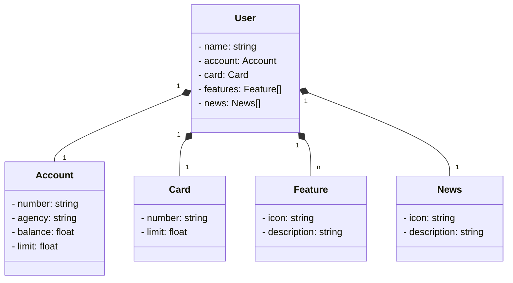

# Santander Dev Week 2024
Projeto feito segungo DIO.me em Java 17 com Spring Boot 3.

## Principais Tecnologias


- [x] Java
- [x] Spring Boot
- [X] Spring Data JPA
- [X] PostgreSQL
- [X] OpenAPI
- [ ] Railway

## Estrutura json
```
{ 
  "name": "Edson Sousa",
  "account": { 
    "number": "01.097924-1",
    "agency": "2024",
    "balance": 564.12,
    "limit": 1000.00
  },
  "card": { 
    "number": "xxxx xxxx xxxx 1234",
    "limit": 2000.00
  },
  "features": [
    {
      "icon": "URL",
      "description": "Descrição da Feature"
    }
  ],
  "news": [
    {
      "icon": "URL",
      "description": "Descrição das novidades"
    }
  ]
}
```

## Diagrama de Classes (Domínio da API)


